# 你知道什么WTF是什么意思么？

> 一个悲伤的程序员...如此，不想说更多...

## 事情从股权变更说起

1） 第一个阶段：公司初始合同

> 37.5% ceo代持，另外37.5分4份，每人9.375%，预留10天使，15%作为员工期权，4年释放

2）第二个阶段：融资天使轮100w美金

> 天使占10%，另外扣5%作为对赌，这样我们3个（张**、谭**）的股份就变成了8.75，4年释放

3）第三个阶段：所谓的引进人才，耍无赖，各种偷换概念稀释

后来王*加入，商量4个人出让10%，作为吸引人才，当时结果是股份减少就要有费用，初期可以少一些，但不能无偿减少，现在就变成了啥都没有就都减少了。。。于是我们3个（张**、谭**）股权就变成7.5

这下又说4年绑定释放，改成5年释放

4）第四个阶段：股份变赠予，并由其代持，如存在异议，放出当初挖好的坑

5）第五个阶段：按1万/月工资算

> 光说你可能不信，下面我一个一个贴图给大家看

### 1） 第一个阶段：公司初始合同

> 37.5% ceo代持，另外37.5分4份，每人9.375%，预留10天使，15%作为员工期权，4年释放

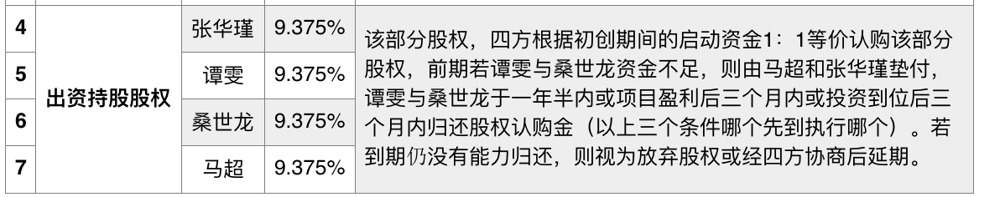


看着是4个创始人，每个人都一样是吧？

**这只是骗局的开始**

```
注意：最开始说的是37.5% ceo代持，后来偷换概念，就变成ceo拥有了。
为此张觉得郁闷，反应过味来，觉得自己拿的比较少，后来找谭和我一起曾与之讨论，
结果马超以各种借口，诸如为了公司稳定、上市后ceo的股份不能动，
可用部分与你们一样等借口，本来大家都觉得ceo多拿点也是正常的，
但直说啊，何必做这些小把戏呢，
于是出于所谓的“大局”，大家都认了
```

### 2）第二个阶段：融资天使轮100w美金

> 天使占10%，另外扣5%作为对赌，这样我们3个（*、谭*）的股份就变成了8.75，4年释放

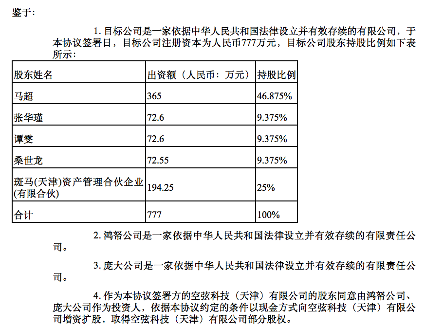

变更后

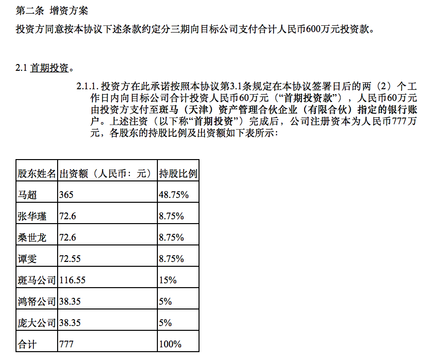

天使投资在2015年10月份开始，那时候美股貌似大跌，导致很多投资结构比较谨慎，所以作为拉投资责任的ceo经过无数次失败，依然没有拉来投资。于是他就动用了它大学的同学，王二龙和墨海，让他们帮忙投资天使部分，约定的是100万美金，估值按6000万算，但这笔钱要拆分成3次给。同时，附加条件是扣创始人5%作为对赌，如果成功拿到下一笔投资，就作为奖励归还，看起来都是很合理的是吧

- 1）扣创始人5%作为对赌，我持怀疑态度，有这种可能性，出于激励考虑是正常的，但后来的说法是：“扣创始人5%，最后归还给公司”，这就不得不让人有所想，按照软件开发领域的开闭原则，最基本的哪里进哪里出，总是对的吧！
- 2）王和墨据说都是身价过亿的大老板，为什么帮好哥们还要如此谨慎呢？九牛一毛嘛

再说说我的想法，我一直是这样想的，同样上一个大学，住一个宿舍，为啥差距这么大呢？我能理解马超这种想努力的动力，说白了，谁也不想承认自己混的不如一个宿舍的吧？我是相信他的动力的，为此我跟谭嘉雯，春晖等都表达过：“如果ceo有如此动力，你还怕公司发展不好么？”

但事实，结果并不是这样，我真不想按照小农思想来思考这个问题，说商人无利不起早我信，说商人为利益无所不做，我是打心眼里不愿相信。

> 技术人员创业，跟对人很重要，撕逼的案例太多了...我们不缺少智商，但我们还是太单纯了，哪怕是cto也如此脆弱，某医疗行业CTO估计已经哭晕在厕所几回了

### 3）所谓的引进人才，耍无赖，增资扩股等各种偷换概念  

后来王威加入，经过商量4个人共出让10%，作为吸引人才，当时结果是股份减少就要有费用，初期可以少一些，但不能无偿减少，现在就变成了啥都没有就都减少了。。。于是我们3个（张**、谭**）股权就变成7.5

这下又说4年绑定释放，改成5年释放

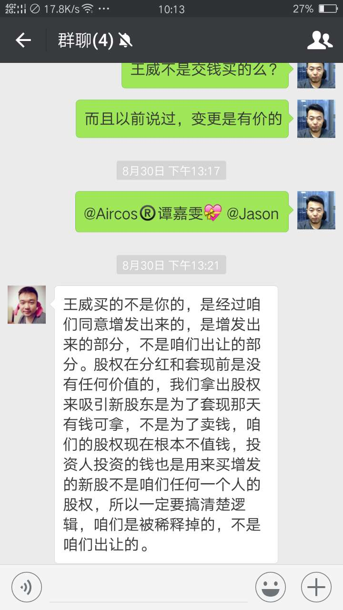

- 1）股份减少就要有费用，如果是增资扩股是要变更注册资本的

没有变更资本而导致股份减少，说白了就是偷换概念，故弄玄虚

这是需要了解一下增资扩股的概念

> 增资扩股是指企业向社会募集股份、发行股票、新股东投资入股或原股东增加投资扩大股权，从而增加企业的资本金。 对于有限责任公司来说，增资扩股一般指企业增加注册资本，增加的部分由新股东认购或新股东与老股东共同认购，企业的经济实力增强，并可以用增加的注册资本，投资于必要的项目。

- 注册资本没有变更，这哪里叫增资扩股？
- 没有出资的人被垫付的钱，股份是归注册的人，还是归垫付的人？

这很明显就是忽悠张**、谭**、我这3个不懂法律的人，反正你不懂，就拿这个概念忽悠你，如果你真的懂，那可能会变更注册资本类似的。

> 可悲的是，互联网行业现状是傻子太多，骗子明显不够用

- 2）4年绑定释放，改成5年释放

一个言必吃契约精神的商人会怎么做呢？目前在谈a轮融资，投资人觉得我们的股份不合理，由4年改成5年释放。

当初签的合同说变就变么？我不懂投资人会怎么做，我也不知道到底什么才算契约精神，如果想变就变，那还要合同干嘛呢？

- 3）关于评价：耍无赖，不厚道

耍无赖指的是对于股份变动，各种忽悠，包括张**之前质疑数量，股份变动无偿等，还有对员工，比如彦合，六饼等人许诺的期权，包括许诺的公积金。我可以举出无数类似的例子，多说无益。

不厚道，当时我指的的我回银川后就把我在天津的社保给断了，那才多少钱啊？当我解释此项之时，人家反问说：“你跟我提了么？”，在天津干了1年多，10个月欠薪，这事儿还要我提么？你到底希望我回去么？

不说了，既然是争论的我就拿出来说，我依然保持原来的观点，没提的我也不会说，省得说我诋毁其人。

### 4）第四个阶段：股份变赠予，并由其代持，如存在异议，放出当初挖好的坑

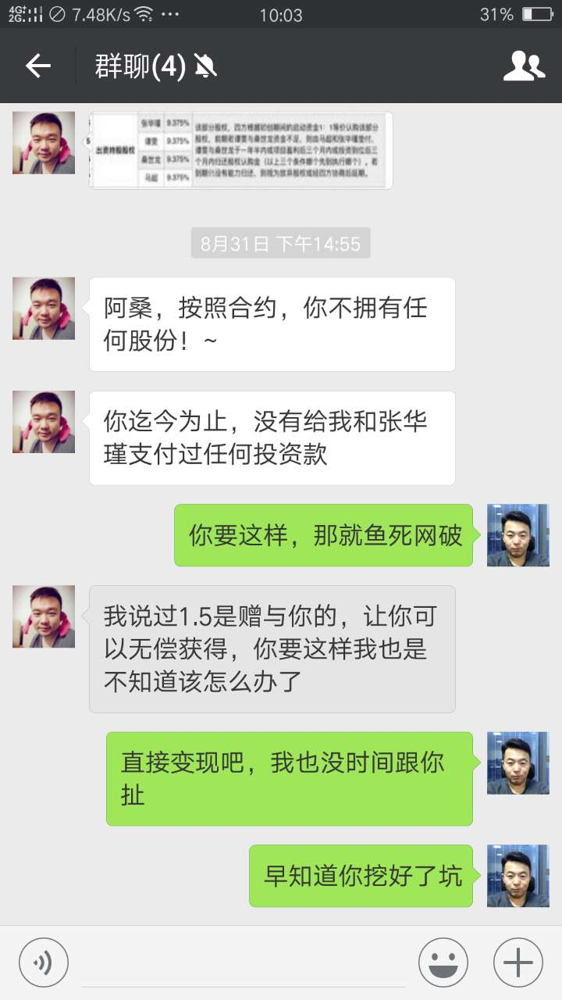

看看如何偷换概念的？


> 垫付是真的，但股份还是在我名下吧？还能更不要脸点么？

于是质疑之后，变成你不拥有，那些股份是赠予，这叫在下如何是好？

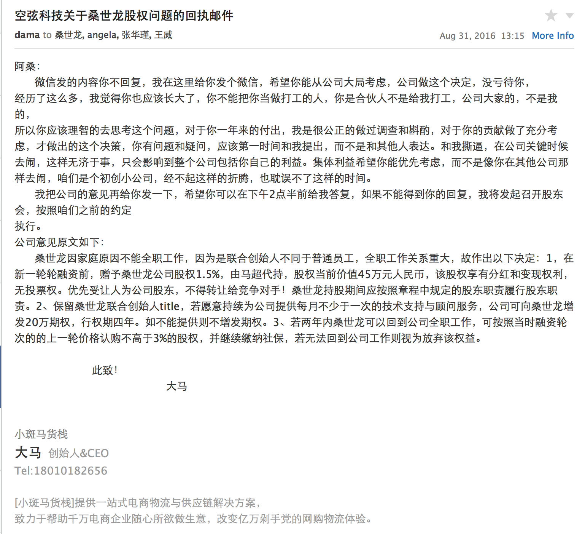

- 注意是代持
- 注意是赠予
- 注意是1.5

还能更狠一点么？

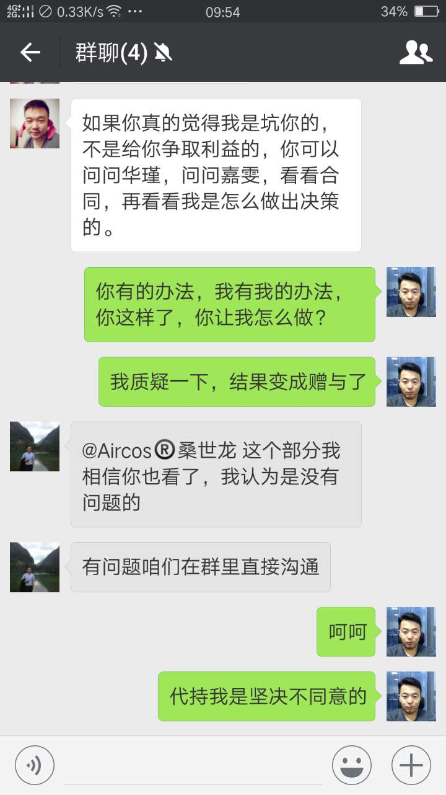

这样的人真心不想和他玩，把我的投入给我拿回来就好，以后大路朝天...

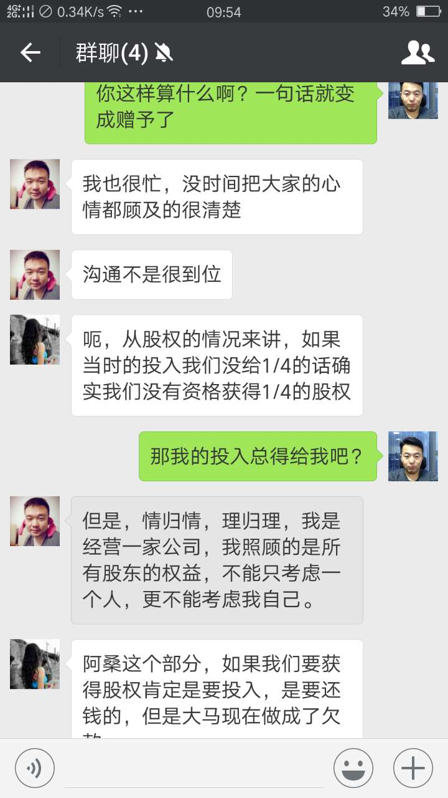

我的底线不高吧？按照现有的股份，就算1.5，按照现有估值45万，变现就得了，我也认了，我也不想参与你们乱七八糟的股权纷争，过分么？

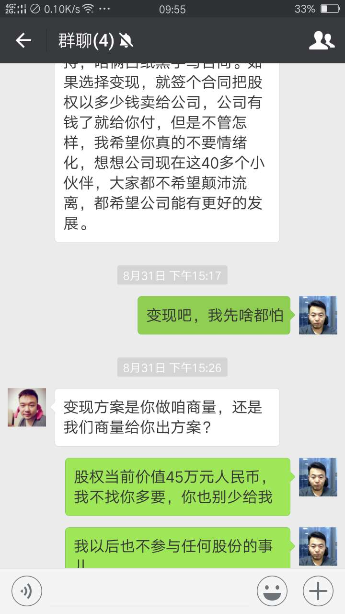


### 5）第五个阶段：按1万/月工资算，你就是个程序员...

```
阿桑你好，
本周2我们召开了股东会，因为你没有回复我周日的通告，当天我和嘉雯多次打了电话，提示无法接通，所以视为你没有出席，放弃投票权利，会议作出了以下两个决议：
1、因为公司这次融资失败，资金紧张，所有人欠薪延后发放。
2、充分的考虑到桑世龙之前在公司的工作情况，根据四方的合伙协议，由于没有按照约定支付给我和华瑾认股的钱，并且不能在公司全职工作，按照协议视为桑世龙放弃该部分股权，同意桑世龙退伙，退伙后的相应补偿办法有两个，你选一个：
2.1、签订相关退出协议后于一年内分两次，付给你之前工作的138000元的欠薪，以及你之前为公司垫付9424.22元的报销，共计147424.22元。若一年期内可以融资到位则一次性给你结清上述款项。
2.2、或签订相关退出协议后向你增发20万元期权，行权期四年，到时候你可以向公司主张行权，怎么也值个百八十万，这样你的收益可能会多很多，可以弥补一些心理落差。
你看有什么意见请于10月3日前给我答复，如有合理要求，咱们可以开会一起协商。如不能给我答复，则按照2.1执行。
经过了一年的合作，无论开心也好，吵闹也罢，毕竟我们是一起合伙做生意，以公司利益出发是我的不便原则，我不希望我们从此变成陌路人。望以后还能互相帮助，携手共进。
```

一下为截图

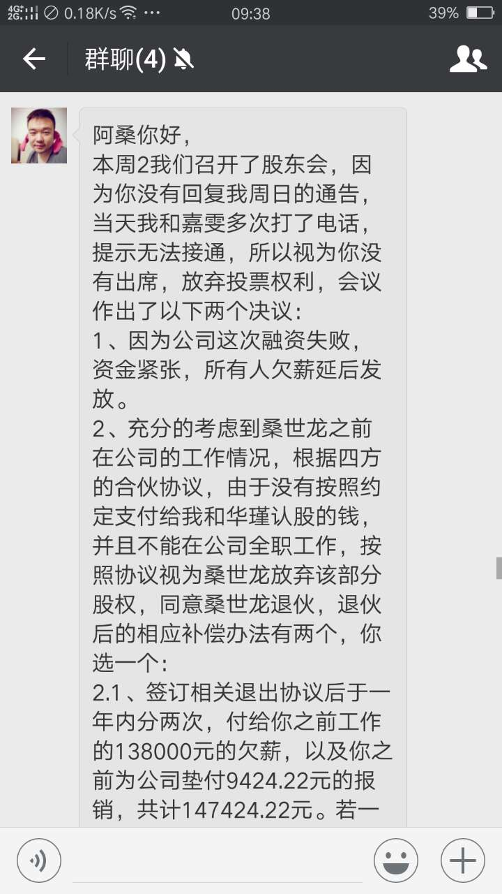

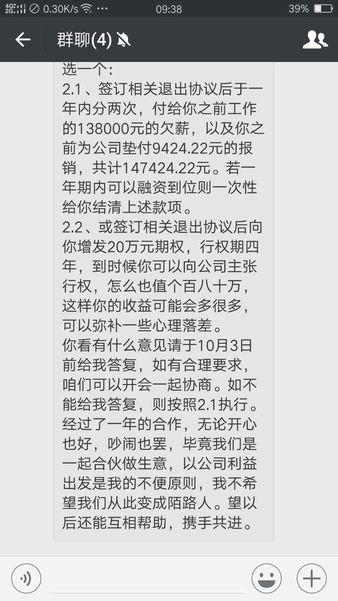

张和谭都确认了结果

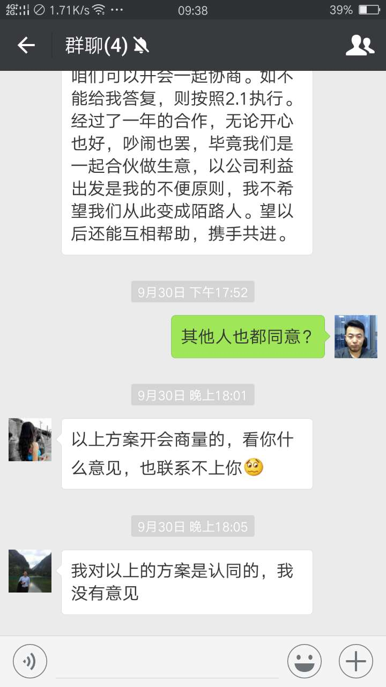

把本来应该改的欠薪说成了补偿福利，是不是也是醉了？莫说我还顶着个CTO title，就算是我的小弟1万/月也请不到...

- 注意方案1是若一年期内可以融资到位才给...
- 注意方案2是发20万元期权，真当我是小孩么？

我的内心是跑了10000匹羊驼...那感觉如下图


## 尽力干活是没错的，我并不后悔

人在做，天在看，虽然曾经很累，但那些都是经验。我常说，技巧性的内容在今天来说已经很容搜索了，但是经营性的东西必须亲身经历的，是无法搜索的，这才是真正的竞争力。

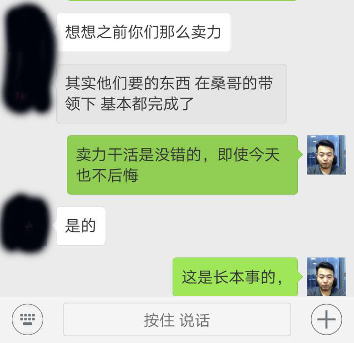

福兮祸所伏，祸兮福所倚

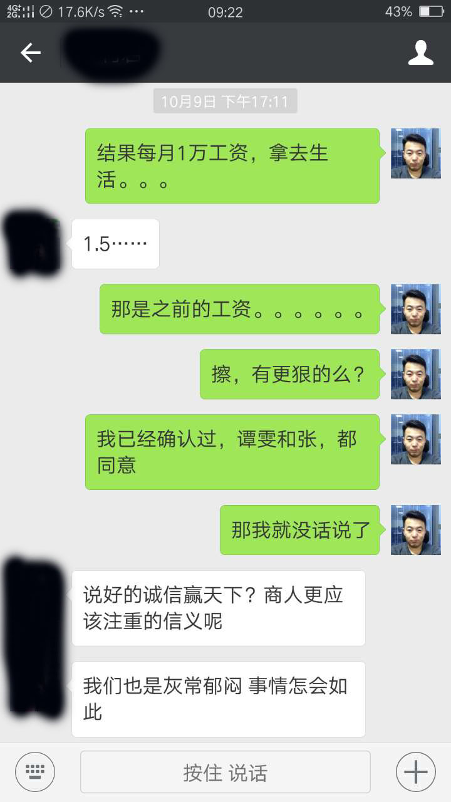

就当是学费吧~

作为一个没有啥办法的cto能做啥呢？律师有朋友推荐，但我浪费不起这个时间。如果一个高层掌握的信息，一手带出的团队，一手搭建的系统都如此不值钱，应该是自己无能吧。

如果各位有什么好办法，还望赐教

## 耽误了好多事儿

- 《更了不起的Node4：将下一代web框架Koa进行到底》延期
- StuQ的翻转课堂，没能及时更新
- StuQ Koa课程，讲完了，我自认为状态不够好
- 《Node.js微信开发》邀约，小程序邀约，Node.js微服务邀约，没敢答应
- Gulp一书的翻译review完3/4，也延期了
- Moa 2框架对Koa 2.x支持还可以，但文档，更多机制无大进展

做教育是架构师不耻的（布道除外），但当时的我只能以此谋生，感谢那些跟我一起学过的同学，我不会一直做教学的。我也不想一直写科普类的教程，但限于当时为了招人，我只能这样做，感谢alsotang，感谢海良等朋友的支持，大家这样捧我，大家开玩笑说，说我的胡子和金刚狼非常像，故而以狼叔名，大家喜欢就叫吧，能让大家娱乐也好。做了一个Node全栈公众号，目前9000多粉丝，等到1万就捐给cnode作为官方微信账号，那时候早上6点多就趴在床上准备公众号文章，现在想来也很难再来一次。

对不住博文视点的编辑张春雨，对不住天天催我交视频的海角，一拖再拖，我不是不想好好做，是我真的静不下心来。

时至今日，我已经不能指望什么了，甚至我那每月1万的工资都不一定能要回来，发文解释一下，一个是算了结，我不能总被这种情绪笼罩，我还有更重要的事儿。另外一个就是纵然一无所有，作为前车之鉴，亦可以给各位朋友提个醒吧！

## 赋诗一首

```
《阴天与睛天》

在晴天写阴天
怎么也情愿
在阴天写睛天
怎么也下不去笔

晴天时，全在祈祷
祝福这温暖的骗局
阴天时，魔鬼控制
开启每个人罪恶的真实

它们都在同一天
它们无辜又坚强
树木止于灿烂温暖
而非那宁静的傍晚

傍晚止于那云
再也不能怅然无忧
那云的脸黑得拧出水
怎么也开心不起来

预测各种预测
阴谋出于阴险
山头大个蚂蚁
迎风狂奔回家

这是白天的晴天
这是傍晚的阴天
看似一切与我们无关
又无法中立

天黑了
无雨亦无晴
山还是那山
苍茫云海间
```
